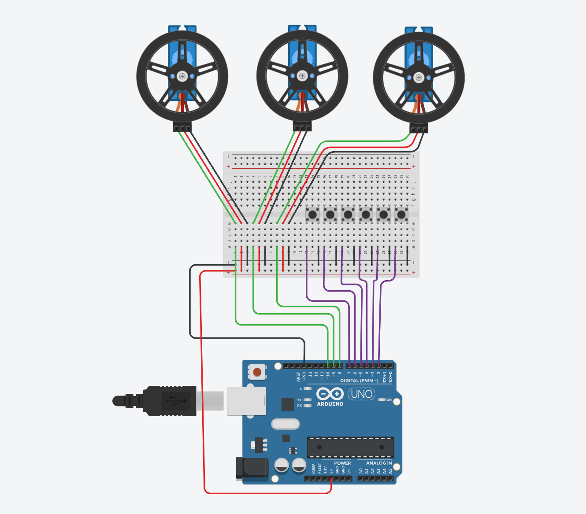

# SpaceCraft Motion Simulator
Replace this text with a brief description (2-3 sentences) of your project. This description should draw the reader in and make them interested in what you've built. You can include what the biggest challenges, takeaways, and triumphs from completing the project were. As you complete your portfolio, remember your audience is less familiar than you are with all that your project entails!

You should comment out all portions of your portfolio that you have not completed yet, as well as any instructions:
```HTML 
<!--- This is an HTML comment in Markdown -->
<!--- Anything between these symbols will not render on the published site -->
```

| **Engineer** | **School** | **Area of Interest** | **Grade** |
|:--:|:--:|:--:|:--:|
| Sangwon C | The Williston Northhampton School | Mechanical Engineering/Aerosapce Engineering | Incoming Senior

**Replace the BlueStamp logo below with an image of yourself and your completed project. Follow the guide [here](https://tomcam.github.io/least-github-pages/adding-images-github-pages-site.html) if you need help.**


  
# Final Milestone

**Don't forget to replace the text below with the embedding for your milestone video. Go to Youtube, click Share -> Embed, and copy and paste the code to replace what's below.**

<iframe width="560" height="315" src="https://www.youtube.com/embed/F7M7imOVGug" title="YouTube video player" frameborder="0" allow="accelerometer; autoplay; clipboard-write; encrypted-media; gyroscope; picture-in-picture; web-share" allowfullscreen></iframe>

For your final milestone, explain the outcome of your project. Key details to include are:
- What you've accomplished since your previous milestone
- What your biggest challenges and triumphs were at BSE
- A summary of key topics you learned about
- What you hope to learn in the future after everything you've learned at BSE


# Milestone 2

**Don't forget to replace the text below with the embedding for your milestone video. Go to Youtube, click Share -> Embed, and copy and paste the code to replace what's below.**

<iframe width="560" height="315" src="https://www.youtube.com/embed/y3VAmNlER5Y" title="YouTube video player" frameborder="0" allow="accelerometer; autoplay; clipboard-write; encrypted-media; gyroscope; picture-in-picture; web-share" allowfullscreen></iframe>

For your second milestone, explain what you've worked on since your previous milestone. You can highlight:
- Technical details of what you've accomplished and how they contribute to the final goal
- What has been surprising about the project so far
- Previous challenges you faced that you overcame
- What needs to be completed before your final milestone

Since the first milestone, I have dedicated time to building a second version of the code. Previuosly, the csimulator was only abel to be controlled by the winding and unwinding of the strings. However, with this new code, xyz coordinates can be inputted to mvoe teh paylaod to that exact coordinate. In order to achieve this, the anchor and payload are written into 3D vector objects. Then, the length of each string needed to move the payoad into a specific coordinate are calculated using the distance formula. Then, the motor winds/unwinds the length of string needed, done by calculating the amount of time needed for the mtoor to wind a certain length of the cable and instructing the motor to spin for that exact amount of time ( This is beacsue a continous servo is used; thus, the position of the mtoor's spin cannot be contorlled nor recordded, hence the alternatvie approach). The main challenge was mastering C++ needed to calculate arduino IDE, as well as learning about different functionsn of the microcontroller such as tracking time through its internal timer. The code constructed so far will be used to complete the thrid milestone, whcih is to build functions for landing, horizontal docking, orbiting, and otehr manuevers.

# Milestone 1

**Don't forget to replace the text below with the embedding for your milestone video. Go to Youtube, click Share -> Embed, and copy and paste the code to replace what's below.**

<iframe width="560" height="315" src="https://www.youtube.com/embed/CaCazFBhYKs" title="YouTube video player" frameborder="0" allow="accelerometer; autoplay; clipboard-write; encrypted-media; gyroscope; picture-in-picture; web-share" allowfullscreen></iframe>


The project is Spacecraft motion simulator, where a model spacecraft will be attatched to strings, which can be tightened or loosed to control the orientation of the craft in three dimensions. The main components of the project include the PVC frame, motors and circuitry to control the strings with buttons, and 3D printed parts such as the motor housing, the dowel to wrap the tring around, etc. So far, I was able to complete the physical as well as complete the initial versions of the circuitry and code. In addition, I have CADed printed the motor, dowel, and model spacecraft and assemble them together to complete the physcial aspsects of the project. One of the biggest challenges I've faced on  eproject are the relatively slwo production of 3D printed parts that have slowed the process down. In addtition, this has been my first time using an arduino, and I had to learn how to use breadboards, assemble circuits, and code in C++. In the next few days, I plan to build programs to automatically move the spacecraft to diffrent positions across the frame, as well as perform tasks such as docking, landing, and orbiting. Then, I plan to introduce modifications, such as manual joystick control of the aircraft rather then the individaul strings, as well as adding one or two more motors for more axises of control. 


# Schematics 

# Code
Here's where you'll put your code. The syntax below places it into a block of code. Follow the guide [here]([url](https://www.markdownguide.org/extended-syntax/)) to learn how to customize it to your project needs. 

```c++
//made 3 servo objects
#include <Servo.h>
Servo sv1; 
Servo sv2; 
Servo sv3;
Servo*motors[3] = {&sv1, &sv2, &sv3}; 

//made 3d vector object 
struct Vec3 {
  float x,y,z;
  };

//extablish forwar and backward speed s
int fwd = 180 ;
int bck = 0 ;
int stop = 90 ;

//made fixed anchors ( IRL screw eyes)(mm)
const Vec3 Ancr1 = {0,0,0}; 
const Vec3 Ancr2 = {165,286, 0}; 
const Vec3 Ancr3 = {-165, 286, 0}; 


//**************CHANGE****************
//decalres starting position
Vec3 startPos = {0,0,0};
//*****************CHANGE**********


//mm of string wrapped by dowel per sec - needs to be calibrated later individually
float mmPerSec[3] = {40,40,40}; 

//variable(per motor - hence 3) storing how long eahc string is.
float currentLength[3]; 

//distance fromula 
float dist (Vec3 A, Vec3 B) { 
  float rx = A.x - B.x , ry = A.y-B.y , rz = A.z - B.z ; 
  return sqrt(rx*rx + ry*ry + rz*rz );
}

//struct representing motor's in progress move
struct motorState {
  bool active; 
  unsigned long startTime; 
  unsigned long duration; 
  float mmStart; 
  float deltaMm;
};
motorState moves[3]; 

//starting a timed motor movement (desired coordinates-> length fo string-> time motor needs to spin)
 void Movecable (int i, float deltMm) { 
  if (fabs(deltaMm)<0.4) return; 
  int dir = (deltaMm > 0 ) ? fwd : bck ; //********MIGHT NEED TO CHANGE DEPENDING ON TEST ********
  moves[i].mmStart = currentLength[i]; 
  moves[i].deltMm = deltMm;
  moves[i].startTime = millis();
  moves[i].active = true; 
  moves[i].duration = (unsigned long)(fabs(deltaMm)/ mmPerSec[i] * 1000.0);  
  motors[i]->write(dir);
 }

// finishes any cable mvoememnt if time has elapsed
void UpdateCableMoves() {
  for (int i = 0; i < 3; i++) {
    if (!moves[i].active) continue;
    if (millis() - moves[i].startTime >= moves[i].duration) {
      currentLength[i] = moves[i].mmStart + moves[i].deltaMm;
      motors[i]->write(stop);
      moves[i].active = false;
    }
  }
}

// ( Inverse kinematics ? ??)function to translate 3d point request into movement for each string. 
void MoveTo ( Vec3 Target ) { 
  float targetlength[3]; 
  targetlength[0] = dist(Ancr1 , Target); 
  targetlength[1] = dist(Ancr2, Target);
  targetlength[2] = dist(Ancr3, Target);
  Movecable(0, (targetlength[0]-currentLength[0]));
  Movecable(1, (targetlength[1]-currentLength[1]));
  Movecable(2, (targetlength[2]-currentLength[2]));
}

//defines moving vs not moving (for imput handling, manual control)
bool IsMoving() {
    for(int i=0;i<3;i++)
        if(moves[i].active || manualStrngCtrl[i].active)
            return true;

    return false;
}

// tracks an in-progress manual button press, per motor
struct ManualState {
  bool active;
  unsigned long startTime;
  int dir;
};

ManualState manualStrngCtrl[3];

const int windPin[3]   = {2, 4, 6};
const int unwindPin[3] = {3, 5, 7};

//function fro manually controlling teh rtinsg via buttons while tracking string length. 
void ManualStringControl() {
  for (int i = 0; i < 3; i++) {
    bool windPressed   = !digitalRead(windPin[i]);
    bool unwindPressed = !digitalRead(unwindPin[i]);

    int wantDir;
    if (windPressed && !unwindPressed) wantDir = bck;      // shortens string
    else if (!windPressed && unwindPressed) wantDir = fwd; // lengthens string
    else wantDir = stop;

    if (wantDir != stop) {
      moves[i].active=false;
      if (!manualStrngCtrl[i].active || manualStrngCtrl[i].dir != wantDir) {
        manualStrngCtrl[i].active = true;
        manualStrngCtrl[i].startTime = millis();
        manualStrngCtrl[i].dir = wantDir;
        motors[i]->write(wantDir);
      }
    } else if (manualStrngCtrl[i].active) {
      float elapsedSec = (millis() - manualStrngCtrl[i].startTime) / 1000.0;
      float delta = elapsedSec * mmPerSec[i];
      currentLength[i] += (manualStrngCtrl[i].dir == fwd) ? delta : -delta;
      manualStrngCtrl[i].active = false;
      motors[i]->write(stop);
    }
  }
}

//INput Handling (recieves the XYZ coordinates)
void ReadSerialCommand() {
  if (!Serial.available()) return;
  String line = Serial.readStringUntil('\n');

  int c1 = line.indexOf(',');
  int c2 = line.indexOf(',', c1 + 1);
  if (c1 == -1 || c2 == -1) {
    Serial.println("ERR: expected format x,y,z");
    return;
  }

  if (IsMoving()) {
    Serial.println("ERR: still moving, command ignored");
    return;
  }

  float x = line.substring(0, c1).toFloat();
  float y = line.substring(c1 + 1, c2).toFloat();
  float z = line.substring(c2 + 1).toFloat();

  MoveTo({x, y, z});
  Serial.println("ZOomin");
}


void setup() {
 Serial.begin(9600);

  pinMode(2, INPUT_PULLUP);
  pinMode(3, INPUT_PULLUP);
  pinMode(4, INPUT_PULLUP);
  pinMode(5, INPUT_PULLUP);
  pinMode(6, INPUT_PULLUP);
  pinMode(7, INPUT_PULLUP);
  sv1.attach(8);
  sv2.attach(9);
  sv3.attach(10);

  currentLength[0] = dist(Ancr1 startPos);
  currentLength[1] = dist(Ancr2, startPos);
  currentLength[2] = dist(Ancr3, startPos);

  Serial.println(currentLength[0]);
  Serial.println(currentLength[1]);
  Serial.println(currentLength[2]);
}


void loop() {
  // put your main code here, to run repeatedly:
  ManualStringControl();
  ReadSerialCommand();
  UpdateCableMoves();
}

```

# Bill of Materials
Here's where you'll list the parts in your project. To add more rows, just copy and paste the example rows below.
Don't forget to place the link of where to buy each component inside the quotation marks in the corresponding row after href =. Follow the guide [here]([url](https://www.markdownguide.org/extended-syntax/)) to learn how to customize this to your project needs. 

| **Part** | **Note** | **Price** | **Link** |
|:--:|:--:|:--:|:--:|
| Item Name | What the item is used for | $Price | <a href="https://www.amazon.com/Arduino-A000066-ARDUINO-UNO-R3/dp/B008GRTSV6/"> Link </a> |
| Item Name | What the item is used for | $Price | <a href="https://www.amazon.com/Arduino-A000066-ARDUINO-UNO-R3/dp/B008GRTSV6/"> Link </a> |
| Item Name | What the item is used for | $Price | <a href="https://www.amazon.com/Arduino-A000066-ARDUINO-UNO-R3/dp/B008GRTSV6/"> Link </a> |

# Other Resources/Examples
One of the best parts about Github is that you can view how other people set up their own work. Here are some past BSE portfolios that are awesome examples. You can view how they set up their portfolio, and you can view their index.md files to understand how they implemented different portfolio components.
- [Example 1](https://trashytuber.github.io/YimingJiaBlueStamp/)
- [Example 2](https://sviatil0.github.io/Sviatoslav_BSE/)
- [Example 3](https://arneshkumar.github.io/arneshbluestamp/)

To watch the BSE tutorial on how to create a portfolio, click here.
