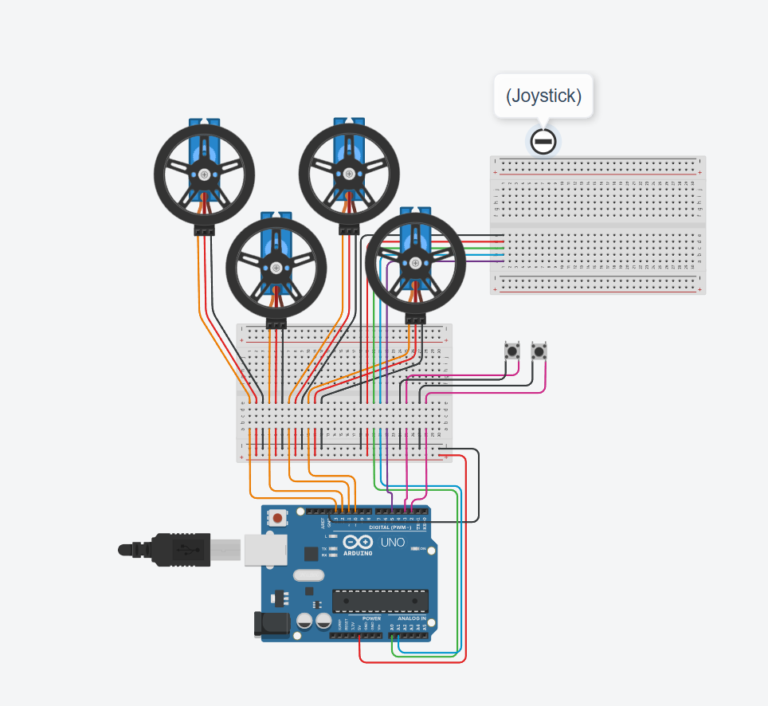

# SpaceCraft Motion Simulator
What if you could simulate the biggest moments of space exploration right on your desktop? This project uses a string-motor mechanism, PVC-built frame, and hundreds of lines of code to simulate three-dimension motion of a 3D-printed payload. It can be controleld by either inputting 3D coordinates or controlling the craft with a joystick. 


| **Engineer** | **School** | **Area of Interest** | **Grade** |
|:--:|:--:|:--:|:--:|
| Sangwon C | The Williston Northhampton School | Mechanical Engineering/Aerosapce Engineering | Incoming Senior

**Replace the BlueStamp logo below with an image of yourself and your completed project. Follow the guide [here](https://tomcam.github.io/least-github-pages/adding-images-github-pages-site.html) if you need help.**


  
# Modifications

**Don't forget to replace the text below with the embedding for your milestone video. Go to Youtube, click Share -> Embed, and copy and paste the code to replace what's below.**

<iframe width="560" height="315" src="https://www.youtube.com/embed/F7M7imOVGug" title="YouTube video player" frameborder="0" allow="accelerometer; autoplay; clipboard-write; encrypted-media; gyroscope; picture-in-picture; web-share" allowfullscreen></iframe>

For your final milestone, explain the outcome of your project. Key details to include are:
- What you've accomplished since your previous milestone
- What your biggest challenges and triumphs were at BSE
- A summary of key topics you learned about
- What you hope to learn in the future after everything you've learned at BSE

I made several modificatiosn after the completion of my base project; I added a 4th motor to expand the range of motion of the payload, attatched a joystick and buttons to manually control the payload with, and printed a box to house the circuitry as well as the joystick and buttons. By far teh biggest challenge was the error optimization. Previously with only 3 strings, the slight errors in the length of strings were not as apparent, since the directions of thw strings did not conflict with each other. However, since the strings are positioned opposite to one another, sligth differenced in wind/unwind distances could result in excess tension and damage to the model. The process of measuring each motor's RPM, wind length, response to torque, etc was a laborious yet rewarding process, as I ultimately got the simulator to mvoe much more smoothly. 

BSE has completely changed the trajectory of my engineering journey for the better. Through various trial and error, I learned how to sodler, work with electronics, and code. I learned the steps of creating a project, from preparation to testing to presenting a final product. Most importantly, I leanred teh importance of keeping track of my own progress. 

I hope to use my experience in BSE as a steppng stone for furtehr projects to come. Currently my goal is to starting making my own quadcopter back home, with motion control and user tracking embedded inside. I hope to keep making projects, learn to create leager ones in college, and become a successful engineer in the future. 


# Milestone 2

**Don't forget to replace the text below with the embedding for your milestone video. Go to Youtube, click Share -> Embed, and copy and paste the code to replace what's below.**

<iframe width="560" height="315" src="https://www.youtube.com/embed/y3VAmNlER5Y" title="YouTube video player" frameborder="0" allow="accelerometer; autoplay; clipboard-write; encrypted-media; gyroscope; picture-in-picture; web-share" allowfullscreen></iframe>

For your second milestone, explain what you've worked on since your previous milestone. You can highlight:
- Technical details of what you've accomplished and how they contribute to the final goal
- What has been surprising about the project so far
- Previous challenges you faced that you overcame
- What needs to be completed before your final milestone

Since the first milestone, I have dedicated time to building a second version of the code. Previuosly, the csimulator was only abel to be controlled by the winding and unwinding of the strings. However, with this new code, xyz coordinates can be inputted to mvoe teh paylaod to that exact coordinate. In order to achieve this, the anchor and payload are written into 3D vector objects. Then, the length of each string needed to move the payoad into a specific coordinate are calculated using the distance formula. Then, the motor winds/unwinds the length of string needed, done by calculating the amount of time needed for the mtoor to wind a certain length of the cable and instructing the motor to spin for that exact amount of time ( This is beacsue a continous servo is used; thus, the position of the motor's spin cannot be contorlled nor recordded, hence the alternatvie approach). The main challenge was mastering C++ needed to calculate arduino IDE, as well as learning about different functionsn of the microcontroller such as tracking time through its internal timer. The code constructed so far will be used to complete the thrid milestone, whcih is to build functions for landing, horizontal docking, orbiting, and otehr manuevers.

# Milestone 1

**Don't forget to replace the text below with the embedding for your milestone video. Go to Youtube, click Share -> Embed, and copy and paste the code to replace what's below.**

<iframe width="560" height="315" src="https://www.youtube.com/embed/CaCazFBhYKs" title="YouTube video player" frameborder="0" allow="accelerometer; autoplay; clipboard-write; encrypted-media; gyroscope; picture-in-picture; web-share" allowfullscreen></iframe>


The project is Spacecraft motion simulator, where a model spacecraft will be attatched to strings, which can be tightened or loosed to control the orientation of the craft in three dimensions. The main components of the project include the PVC frame, motors and circuitry to control the strings with buttons, and 3D printed parts such as the motor housing, the dowel to wrap the tring around, etc. So far, I was able to complete the physical as well as complete the initial versions of the circuitry and code. In addition, I have CADed printed the motor, dowel, and model spacecraft and assemble them together to complete the physcial aspsects of the project. One of the biggest challenges I've faced on  eproject are the relatively slwo production of 3D printed parts that have slowed the process down. In addtition, this has been my first time using an arduino, and I had to learn how to use breadboards, assemble circuits, and code in C++. In the next few days, I plan to build programs to automatically move the spacecraft to diffrent positions across the frame, as well as perform tasks such as docking, landing, and orbiting. Then, I plan to introduce modifications, such as manual joystick control of the aircraft rather then the individaul strings, as well as adding one or two more motors for more axises of control. 


# Schematics 

# Code
Here's where you'll put your code. The syntax below places it into a block of code. Follow the guide [here]([url](https://www.markdownguide.org/extended-syntax/)) to learn how to customize it to your project needs. 

```c++
//made 4 servo objects
#include <Servo.h>
#include <math.h>

Servo sv1; 
Servo sv2; 
Servo sv3;
Servo sv4;

Servo* motors[4] = {&sv1, &sv2, &sv3, &sv4}; 

//made 3d vector object 
struct Vec3 {
  float x,y,z;
  };

//extablish forwar and backward speed s
int fwd = 135 ;
int bck = 45 ;
int stop = 90 ;

//made fixed anchors ( IRL screw eyes)(mm)
const Vec3 Ancr1 = {0,0,0}; 
const Vec3 Ancr2 = {302,0,0}; 
const Vec3 Ancr3 = {0,302,0}; 
const Vec3 Ancr4 = {302,302,0};


Vec3 attachOffset[4] = {
  {-21.6505, -16.3125, 0}, // matches Ancr1 (bottom-left)
  { 21.6505, -16.3125, 0}, // matches Ancr2 (bottom-right)
  {- 21.6505, 16.3125, 0}, // matches Ancr3 (top-left)
  { 21.6505,  16.3125, 0}// matches Ancr4 (top-right)
};


Vec3 startPos = {151, 151, -25};

//constarisnt ( so payload doenst try to go outside frame)
const float FRAME_MIN_X = 0;
const float FRAME_MAX_X = 302;
const float FRAME_MIN_Y = 0;
const float FRAME_MAX_Y = 302;
const float FRAME_MIN_Z = -250;    // can't go above/at anchor height
const float FRAME_MAX_Z = 0;

//mm of string wrapped by dowel per sec - calibrated using slow mo camera and shi
float mmPerSec[4] = {56.3,57.0,58.5,55.8}; 

//variable(per motor - hence 3) storing how long eahc string is.
float currentLength[4]; 

//distance fromula 
float dist (Vec3 A, Vec3 B) { 
  float rx = A.x - B.x , ry = A.y-B.y , rz = A.z - B.z ; 
  return sqrt(rx*rx + ry*ry + rz*rz );
}

// given the payload's center target, compute the required length for
// each of the 4 strings (accounting for the corner offsets above).
// Shared by setup() and MoveTo() 
void ComputeTargetLengths(Vec3 target, float* outLengths) {
  Vec3 attachPoint;

  attachPoint = { target.x + attachOffset[0].x, target.y + attachOffset[0].y, target.z + attachOffset[0].z };
  outLengths[0] = dist(Ancr1, attachPoint);

  attachPoint = { target.x + attachOffset[1].x, target.y + attachOffset[1].y, target.z + attachOffset[1].z };
  outLengths[1] = dist(Ancr2, attachPoint);

  attachPoint = { target.x + attachOffset[2].x, target.y + attachOffset[2].y, target.z + attachOffset[2].z };
  outLengths[2] = dist(Ancr3, attachPoint);

  attachPoint = { target.x + attachOffset[3].x, target.y + attachOffset[3].y, target.z + attachOffset[3].z };
  outLengths[3] = dist(Ancr4, attachPoint);
}

//makes sure paylaod does not go outside frame 
bool InBounds(Vec3 target) {
  for (int i = 0; i < 4; i++) {
    float ax = target.x + attachOffset[i].x;
    float ay = target.y + attachOffset[i].y;
    if (ax < FRAME_MIN_X || ax > FRAME_MAX_X) return false;
    if (ay < FRAME_MIN_Y || ay > FRAME_MAX_Y) return false;
  }
  if (target.z < FRAME_MIN_Z || target.z > FRAME_MAX_Z) return false;
  return true;
}

//struct representing motor's in progress move
struct motorState {
  bool active; 
  unsigned long startTime; 
  unsigned long duration; 
  float mmStart; 
  float deltMm;
};

motorState moves[4]; 

//starting a timed motor movement (desired coordinates-> length fo string-> time motor needs to spin)
void Movecable (int i, float deltMm) { 
  if (deltMm == 0) return; 
  int dir = (deltMm > 0 ) ? bck : fwd; 
  
  moves[i].mmStart = currentLength[i]; 
  moves[i].deltMm = deltMm;
  moves[i].startTime = millis();
  moves[i].active = true; 
  moves[i].duration = (unsigned long)(fabs(deltMm)/ mmPerSec[i] * 1000.0);  
  motors[i]->write(dir);
}

// finishes any cable mvoememnt if time has elapsed
void UpdateCableMoves() {
  for (int i = 0; i < 4; i++) {
    if (!moves[i].active) continue;
    if (millis() - moves[i].startTime >= moves[i].duration) {
      currentLength[i] = moves[i].mmStart + moves[i].deltMm;
      motors[i]->write(stop);
      moves[i].active = false;
    }
  }
}

// ( Inverse kinematics ? ??)function to translate 3d point request into movement for each string. 
void MoveTo ( Vec3 Target ) { 
  float targetlength[4];
  ComputeTargetLengths(Target, targetlength);

  Movecable(0, (targetlength[0]-currentLength[0]));
  Movecable(1, (targetlength[1]-currentLength[1]));
  Movecable(2, (targetlength[2]-currentLength[2]));
  Movecable(3, (targetlength[3]-currentLength[3]));
}
// uses tarcked current position as starting p[oint of jouystick jog
Vec3 currentTarget;

//checks if in bounds etc ( shared with both manual jog and coordinate oriented movement)
bool TryMoveTo(Vec3 target) {
  if (!InBounds(target)) return false;
  MoveTo(target);
  currentTarget = target;
  return true;
}

//joystick manual jog control thingy 
const int JOY_X_PIN = A0;
const int JOY_Y_PIN = A1;
const int BUTTON_UP_PIN   = 2; // verify this actually raises the payload
const int BUTTON_DOWN_PIN = 3; // verify this actually lowers the payload

const int JOY_CENTER   = 512; // rest value - prevent stick drift 
const int JOY_DEADZONE = 60;  // ignore small drift around center
const float JOG_STEP_XY = 5.0; // mm per jog step ( can be adjusted, but bigger-> choppier motion)
const float JOG_STEP_Z  = 5.0; // mm per jog step

void JoystickControl() {
  if (IsMoving()) return; // wait for the current step to finish before sending the next to make sure no overlap

  int jx = analogRead(JOY_X_PIN) - JOY_CENTER;
  int jy = analogRead(JOY_Y_PIN) - JOY_CENTER;
  bool up   = !digitalRead(BUTTON_UP_PIN);
  bool down = !digitalRead(BUTTON_DOWN_PIN);

  Vec3 target = currentTarget;
  bool wantsMove = false;

  if (abs(jx) > JOY_DEADZONE) {
    target.x += (jx > 0) ? JOG_STEP_XY : -JOG_STEP_XY;
    wantsMove = true;
  }
  if (abs(jy) > JOY_DEADZONE) {
    target.y += (jy > 0) ? JOG_STEP_XY : -JOG_STEP_XY;
    wantsMove = true;
  }
  if (up && !down) {
    target.z -= JOG_STEP_Z;
    wantsMove = true;
  } else if (down && !up) {
    target.z += JOG_STEP_Z;
    wantsMove = true;
  }

  if (wantsMove && !TryMoveTo(target)) {
    Serial.println("edge reached");
  }
}


//defines moving vs not moving (for imput handling, manual control)
bool IsMoving() {
    for(int i=0;i<4;i++)
        if(moves[i].active)
            return true;

    return false;
}


//INput Handling (recieves the XYZ coordinates)
void ReadSerialCommand() {
  if (!Serial.available()) return;

  String line = Serial.readStringUntil('\n');

  if (line == "status") {
    Serial.print("L0: "); Serial.println(currentLength[0]);
    Serial.print("L1: "); Serial.println(currentLength[1]);
    Serial.print("L2: "); Serial.println(currentLength[2]);
    Serial.print("L3: "); Serial.println(currentLength[3]);
    return;
  }

  int c1 = line.indexOf(',');
  int c2 = line.indexOf(',', c1 + 1);

  if (c1 == -1 || c2 == -1) {
    Serial.println("Expects format x,y,z");
    return;
  }

  if (IsMoving()) {
    Serial.println("still moving, command ignored");
    return;
  }

  float x = line.substring(0, c1).toFloat();
  float y = line.substring(c1 + 1, c2).toFloat();
  float z = line.substring(c2 + 1).toFloat();

  Vec3 target = {x, y, z};

  if (!TryMoveTo(target)) {
    Serial.println("coordinate out of frame");
  } else {
    Serial.println("Moving");
  }
}


void setup() {
 Serial.begin(9600);

  pinMode(2, INPUT_PULLUP);
  pinMode(3, INPUT_PULLUP);


  sv1.attach(10);
  sv2.attach(11);
  sv3.attach(12);
  sv4.attach(13);


  ComputeTargetLengths(startPos, currentLength);
  currentTarget = startPos;

  Serial.println(currentLength[0]);
  Serial.println(currentLength[1]);
  Serial.println(currentLength[2]);
  Serial.println(currentLength[3]);
}


void loop() {
  JoystickControl();
  ReadSerialCommand();
  UpdateCableMoves();
}
```

# Bill of Materials
Here's where you'll list the parts in your project. To add more rows, just copy and paste the example rows below.
Don't forget to place the link of where to buy each component inside the quotation marks in the corresponding row after href =. Follow the guide [here]([url](https://www.markdownguide.org/extended-syntax/)) to learn how to customize this to your project needs. 

| **Part** | **Note** | **Price** | **Link** |
|:--:|:--:|:--:|:--:|
| Item Name | What the item is used for | $Price | <a href="https://www.amazon.com/Arduino-A000066-ARDUINO-UNO-R3/dp/B008GRTSV6/"> Link </a> |
| Item Name | What the item is used for | $Price | <a href="https://www.amazon.com/Arduino-A000066-ARDUINO-UNO-R3/dp/B008GRTSV6/"> Link </a> |
| Item Name | What the item is used for | $Price | <a href="https://www.amazon.com/Arduino-A000066-ARDUINO-UNO-R3/dp/B008GRTSV6/"> Link </a> |

# Other Resources/Examples
One of the best parts about Github is that you can view how other people set up their own work. Here are some past BSE portfolios that are awesome examples. You can view how they set up their portfolio, and you can view their index.md files to understand how they implemented different portfolio components.
- [Example 1](https://trashytuber.github.io/YimingJiaBlueStamp/)
- [Example 2](https://sviatil0.github.io/Sviatoslav_BSE/)
- [Example 3](https://arneshkumar.github.io/arneshbluestamp/)

To watch the BSE tutorial on how to create a portfolio, click here.
